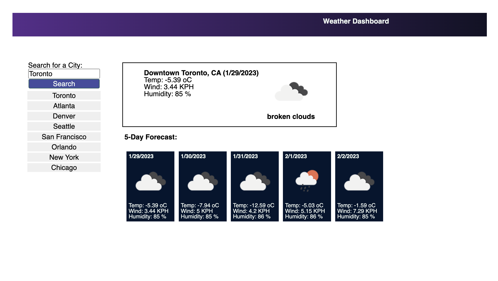

# Weather Dashboard

Weather dashboard is a simple application runs in the browser and features the calls to external APIs to retrieve weather data for multiple cities using specific parameters in a URL.
The search history for the cities is stored in local storage of the browser loaded every time the application is restarted in the browser.

## Description

This application runs in the browser and features dynamically updated API requestst to the 3rd party service (OpenWeather) to fetch the weather information for specific locations. The user is a traveller who would like to monitor the weather conditions across the multiple cities for the period of 5 days.

## Installation

An app is live on Internet and requires to enter and run the following URL from the browser:

https://vasilyl1.github.io/weather-dashboard

## Usage

When the application is launched in the browser, the user is offered to perform the search for the city in question to get the weather conditions. Alternatively, there is a possibility to select one of the pre-defined or previously searched locations for quick use and convenience. The most recently search locations are displayed on top, the locations which are selected from the list are not changing the list so it starts to serve like a cache for the most often used locations.

Attached screenshot features the screen of the loaded application:

## Credits

OpenWeathermap.org for the API

## License

MIT License

Copyright (c) 2022 vasilyl1

Permission is hereby granted, free of charge, to any person obtaining a copy of this software and associated documentation files (the "Software"), to deal in the Software without restriction, including without limitation the rights to use, copy, modify, merge, publish, distribute, sublicense, and/or sell copies of the Software, and to permit persons to whom the Software is furnished to do so, subject to the following conditions:

The above copyright notice and this permission notice shall be included in all copies or substantial portions of the Software.

THE SOFTWARE IS PROVIDED "AS IS", WITHOUT WARRANTY OF ANY KIND, EXPRESS OR IMPLIED, INCLUDING BUT NOT LIMITED TO THE WARRANTIES OF MERCHANTABILITY, FITNESS FOR A PARTICULAR PURPOSE AND NONINFRINGEMENT. IN NO EVENT SHALL THE AUTHORS OR COPYRIGHT HOLDERS BE LIABLE FOR ANY CLAIM, DAMAGES OR OTHER LIABILITY, WHETHER IN AN ACTION OF CONTRACT, TORT OR OTHERWISE, ARISING FROM, OUT OF OR IN CONNECTION WITH THE SOFTWARE OR THE USE OR OTHER DEALINGS IN THE SOFTWARE.